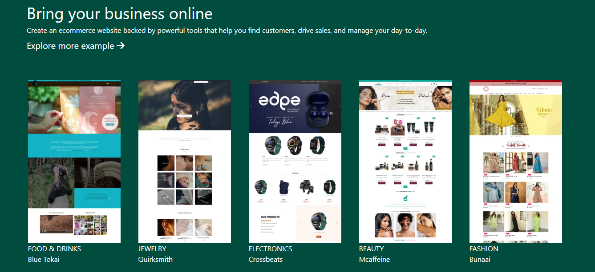
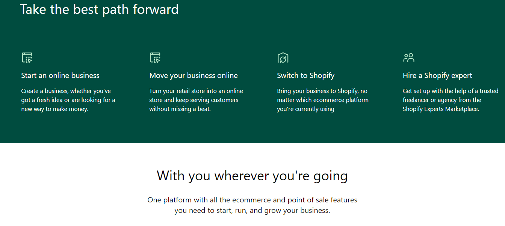
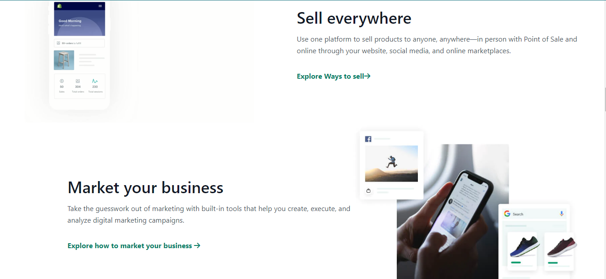
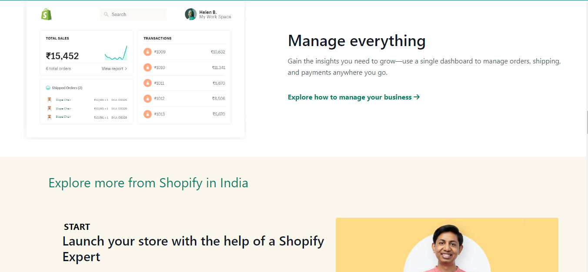
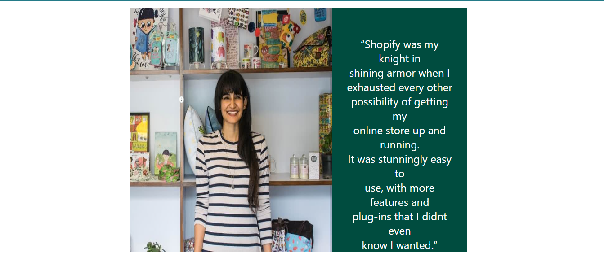
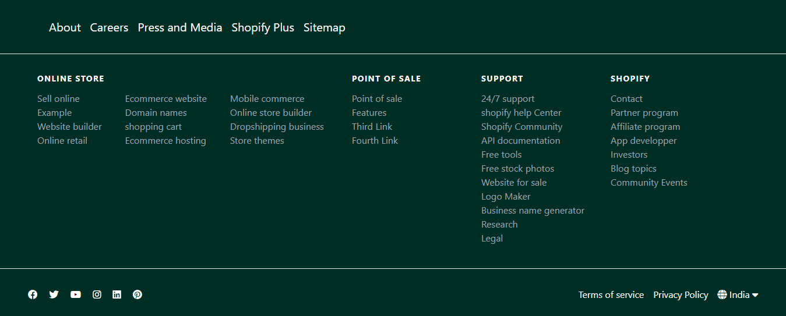

# Shopify.com
## Technology That I use

## Features

- Mobile Responsive.
- Tablet Responsive.
- Fullscreen Responsive.

## What I learn from this projects

- I learn Tailwind Css Fraamework.
- How to make Responsive site using Tailwind Css.
- How Flexbox work on Tailwind Css.
- How grid work on Tailwind Css.

## Complete Time

- It's takes near about 5 Hrs.